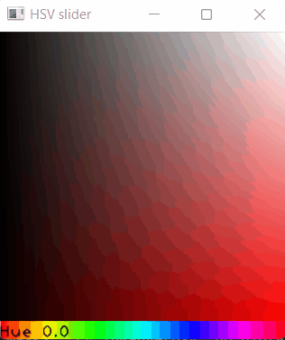
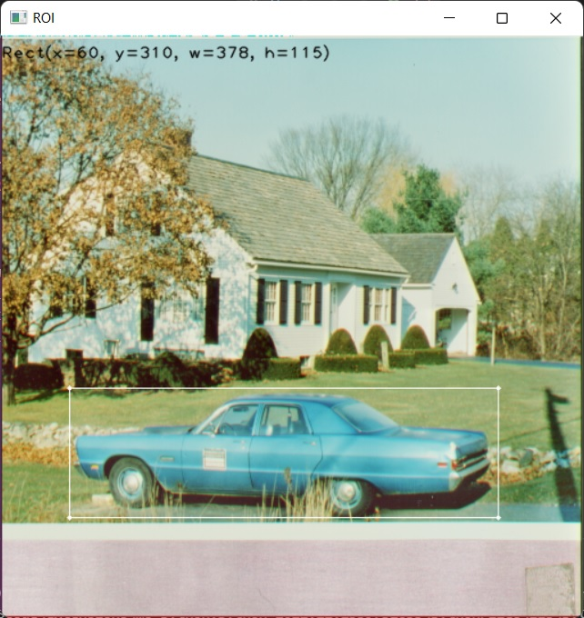

# HSV Color Picker and ROI
## Color Picker
HSV Color Picker widget for OpenCV (Python) allows to select hue value and
saturation/brightness range with your mouse cursor.



Usage example (see `demo.py`):
```
import cv2 as cv

from hsv_color_picker import SliderHSV


color_slider = SliderHSV("HSV slider", normalized_display=True)
while True:
    k = cv.waitKey(5) & 0xFF
    if k == 27:
        break
```

## ROI
`selection.RectSelection` class allows to select ROI on any loaded image.
The selection rectangle can be moved or resized using the mouse cursor.



Usage example (see `demo_roi.py`):
```
import cv2

from hsv_color_picker.selection import RectSelection


img = cv2.imread("house.jpg")
cv2.imshow('ROI', img)
sel = RectSelection('ROI', img)

while True:
    k = cv2.waitKey(5) & 0xFF
    if k == 27:
        break
```

### selectROI
`selection.selectROI` function implements interface of
[cv2.selectROI](https://docs.opencv.org/4.x/d7/dfc/group__highgui.html#ga8daf4730d3adf7035b6de9be4c469af5).

```
import cv2

from hsv_color_picker.selection import selectROI

img = cv2.imread("house.jpg")
rc = selectROI(img)
print(rc)
```
